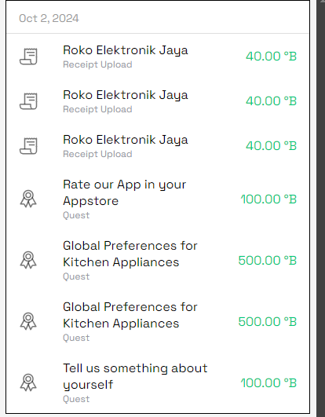

# Struk Transaksi Generator

## Deskripsi
Skrip Python ini digunakan untuk menghasilkan gambar struk transaksi lengkap dengan barcode dari nomor transaksi. Data transaksi diambil dari file `data.json`, dan output disimpan dalam format gambar (PNG).

## Cara Instalasi
1. Pastikan Anda sudah menginstal **Python 3.x**.
2. Instal modul Python yang diperlukan dengan perintah berikut:

   ```bash
   pip install Pillow requests python-barcode
   ```
   
## Cara Penggunaan
1. Edit file `data.json` sesuai dengan transaksi Anda edit aja tokonya harganya dan tx numbernya.
2. Jalankan skrip dengan perintah:

   ```bash
   python3 png.py
   ```

3. Gambar struk akan disimpan di folder `pngtransaksi` dengan nama `receipt_[transaction_number].png`.


## Lisensi
Proyek ini menggunakan lisensi MIT.
